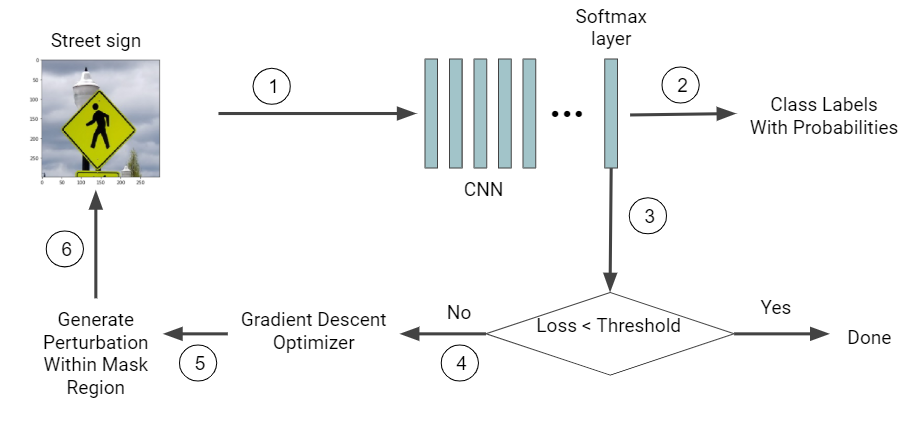
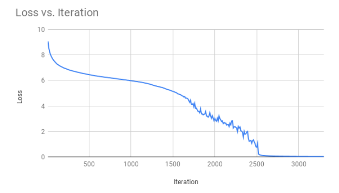
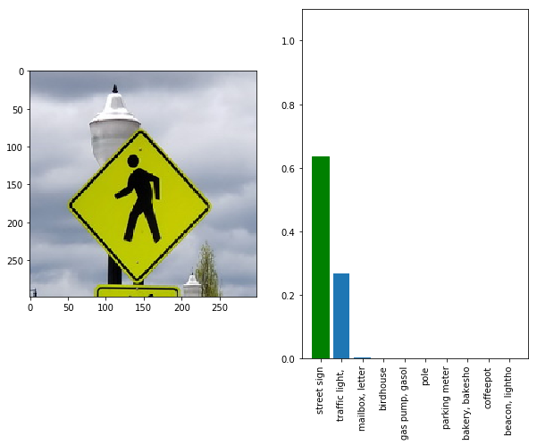
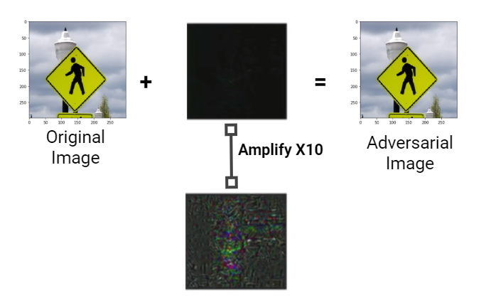
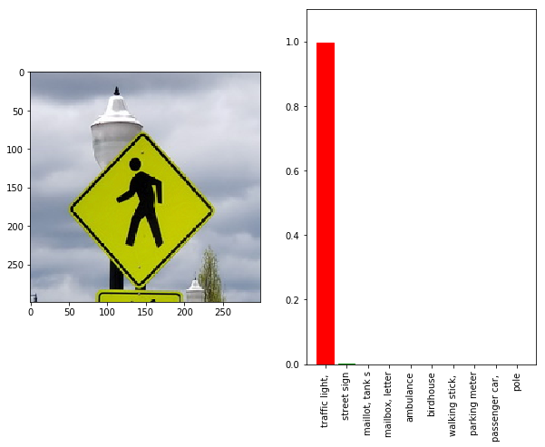

# Adversarial Attack on Autonomous Vehicles - An Approach To Deceive Traffic Light Detection System

Autonomous cars are gradually occupying the streets. In the near future, they will become ubiquitous. Recent events that resulted in the loss of human lives force us to raise questions about their security, primarily concerning their onboard learning algorithms that act as the brains of the car. This work exposes one such vulnerability i.e. street sign misclassified as a traffic light. To the best of our knowledge, this vulnerability has not been explored in the existing literature. We achieve the stated vulnerability using a white box adversarial attack by creating perturbations that can fool a machine learning algorithm to misclassify traffic lights. We consider the ImageNet dataset and our custom-curated dataset to test and train our model and generate adversarial images to expose vulnerabilities in the learning algorithm.

To accomplish the task, we use Inception-v3 model. Specifically, the target image is passed through a Convolutional Neural Network (CNN). The loss will be calculated from the softmax layer. The gradient descent optimizer calculates the perturbation from the loss function. The perturbation is added in the target image and gets evaluated in the CNN again. We evaluate our performance of the generated image using L2 distance and Structural Similarity Index (SSIM).

## ML models and Tools:

- Inception V3
- Transfer Learning
- Convolutional Neural Network (CNN)

## Dataset used:

- ImageNet
- Custom dataset

## System Architecture

## Loss function convergence with training iterations

## Classification results of trained model after transfer learning

## Perturbation, mask generation and adversarial image

## Classification results of previously trained model on adversarial image

## Source Code and Data

- [CODE](https://github.com/anik801/AdversarialAttackTrafficSystem/blob/main/main.ipynb) is the source code for the task.
- [CUSTOM DATASET](https://github.com/anik801/AdversarialAttackTrafficSystem/blob/main/data_files) contains the custom curated dateset used in this project.
- [PRE-TRAINED MODEL](https://github.com/anik801/AdversarialAttackTrafficSystem/blob/main/inception_v3_2016_08_28.tar.gz) contains the pre-trained Inception-v3 model.
- [TRANSFER LEARNED MODEL](https://github.com/anik801/AdversarialAttackTrafficSystem/tree/main/retrained_model) contains the transfer learned model.
- [REPORT](https://github.com/anik801/AdversarialAttackTrafficSystem/blob/main/Adversarial_Attack_on_Traffic_Lights_to_Deceive_Autonomous_Vehicles_Final_Report.pdf) contains detailed project report.

## Project Team and Contributors

- [Sheik Murad Hassan Anik](https://www.linkedin.com/in/anik801/)
- Tahsin Mullick
- Sharmin Afrose
